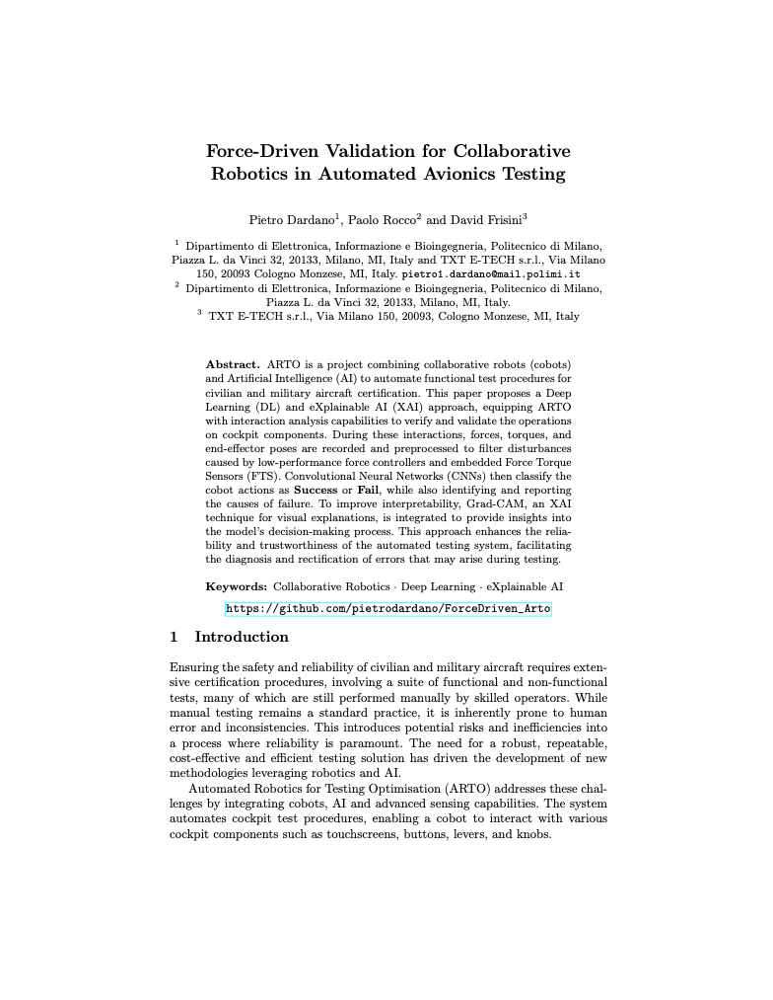

    <h1>
    <i>Supplementary Material</i>  
    Force-Driven Validation for Collaborative Robotics in Automated Avionics Testing
    </h1>

<b> Pietro Dardano, Paolo Rocco and David Frisini </b>  
Paper submitted and accepted to:  
<b>19th International Conference on Intelligent Autonomous Systems- IAS-19 </b>

___

<!--  -->

<!--  -->

___

## Schemes and Drawings will be updated soon !